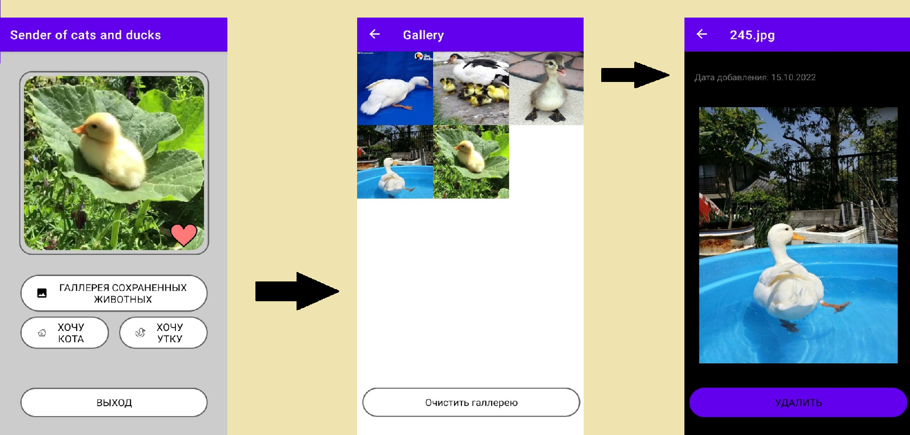
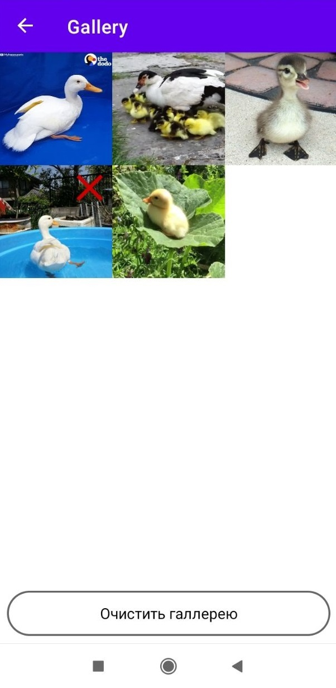

# Sender of cats and ducks
## 👋

Данный проект является рефакторингом старого тестового задания.

____
## Краткое описание

Необходимо получать фотографии по следующим API:
1. [API котиков](https://github.com/ThatCopy/catAPI/wiki/Docs)
2. [API уточек](https://random-d.uk/api)

Полученную фотографию можно будет сохранять и в дальнейшем просматривать. В экране просмотра ее можно будет удалить. Более подробно требования к заданию можно будет прочитать в приложенном к репозиторию файле [test-task.pdf](test-task.pdf)

____
## Навигация
В приложении предусмотрено 3 экрана:
* Экран главного меню
* Экран галлереи
* Экран картинки

Переходы между экранами:
1. клик по кнопке "ГАЛЛЕРЕЯ СОХРАНЕННЫХ ЖИВОТНЫХ" открывает экран галлереи.
2. Клик по любой из картинок в галлереи открывает экран с кликнутой картинкой.

_____
## Удаление конкретной картинки с экрана Галлереи
При длительном удержании картинки будет появляться крестик, по нажатию на который будет удалена картинка.